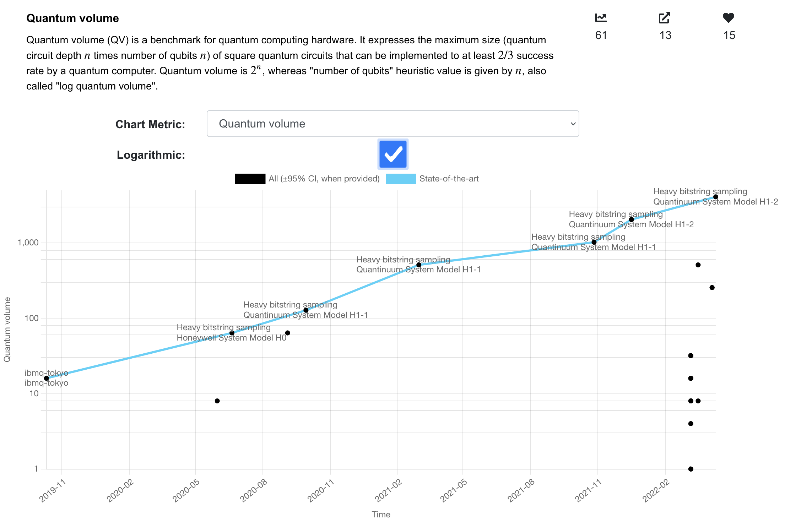

# [](http://metriq.info)

Metriq is a community-driven platform for hosting quantum benchmarks.
It's main focus is to help answer the following question:

> How does quantum computing platform X running software stack Y perform on workload Z and how has that changed over time?

Below shows an example of [quantum volume](https://en.wikipedia.org/wiki/Quantum_volume) measurements that have been achieved by hardware providers over the past 3 years.


Metriq is free to sign up and submit results, whether you are a researcher publishing your own results, or a reader who wants to add data.
Both are much appreciated!

## Motivation

There has been rapid progress in quantum computing, but it can be hard to track that progress.
Researchers want to know how to compare against the state of the art and users want to know what tools best suit them.

Metriq is a free and open source platform that helps anyone better answer this question for themselves.

Researchers and developers in academia and industry can submit results on existing benchmarks or propose new benchmarking tasks to the community.
Results include sources and are openly accessible.
It is free to sign up and submit.

Metriq accelerates research by upgrading the taxonomy of reported results that are often now locked away in tables of review papers.
By making the data explorable and live-updated we’ll be able to make better progress together to develop quantum technology.


## Setting up for Metriq development

In order to locally run and host the `metriq` application we require the use of the following GitHub repositories:

- `metriq-app`: The front-end component of `metriq`
- `metriq-api`: The back-end component of `metriq`
- `metriq-client`: This is a Python API client that posts submissions and other data to the back-end component of `metriq`
- `metriq-postgres`: **(Optional)** This contains the exported PostgreSQL collections of our development and database.

### Setting up `metriq-api`

The following system variables need to be present in your `.bashrc` file. Add
the following lines into your `.bashrc`, making sure to alter the values of the
`[REDACTED]` entries as necessary.

```bash
export METRIQ_SECRET_KEY='[REDACTED]'
export METRIQ_SUPPORT_EMAIL_SERVICE='gmail'
export METRIQ_SUPPORT_EMAIL_ACCOUNT='metriq@unitary.fund'
export METRIQ_SUPPORT_EMAIL_PASSWORD='[REDACTED]'
export METRIQ_SUPPORT_EMAIL_ADDRESS='metriq@unitary.fund'
```

`METRIQ_SECRET_KEY` can be anything, but, for a realistic secret key, start the API project without this environment variable set at all. The app will automatically generate and print a random secret key for temporary use, and this can copied and pasted into `export METRIQ_SECRET_KEY=...` for permanent use.

### Dependencies

You will need
[`npm`](https://docs.npmjs.com/downloading-and-installing-node-js-and-npm)
installed on your machine.

Install [`nodemon`](https://www.npmjs.com/package/nodemon).

You will require [Postman](https://winter-zodiac-492730.postman.co/home) and
will need to request to be added to the Postman account associated with
`metriq`.

### Usage

Run the `metriq-api` component from the root of the `metriq-api` project:

```bash
nodemon start index.js
```

You should see output that looks like the following to indicate that it is
running on port `8080`. 

```bash
➜  metriq-api git:(main) nodemon index.js
[nodemon] 2.0.7
[nodemon] to restart at any time, enter `rs`
[nodemon] watching path(s): *.*
[nodemon] watching extensions: js,mjs,json
[nodemon] starting `node index.js`
Db connection successful
Support email is configured.
Running RestHub on port 8080
```

Initialize submodules with `git submodule init` and `git submodule update`.

Run the `metriq-app` component from the root of the `metriq-app` project:

```bash
npm install
npm start
```

You should see something like:

```bash
Compiled successfully!

You can now view metriq in the browser.

  Local:            http://localhost:3000
  On Your Network:  http://10.102.87.32:3000

Note that the development build is not optimized.
To create a production build, use npm run build.
```

to indicate that the local instance of the website is being hosted as
`http://localhost:3000`. You can verify this by opening a browser and navigating
to localhost URL.

Once you have both `metriq-api` and `metriq-app` hosting locally, you can seed
the local instance of the database with the data from the
[`metriq-postgres`](https://github.com/unitaryfund/metriq-postgres) repo.

Following the instructions in the `README.md` file of the `metriq-postgres` repo will
populate your local instance of the database with dummy data from the `.JSON`
files.
